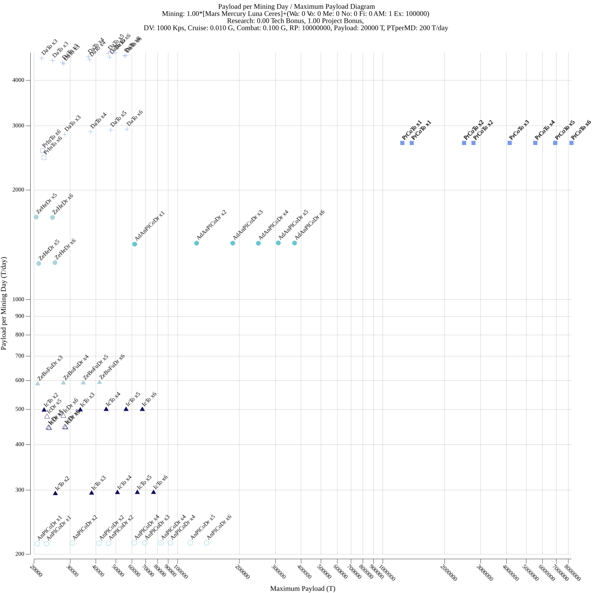

# Terra Invicta Tools
`ti_tools` is a set tools to help with various aspects of Terra Invicta gameplay.
Currently it only consists of a `drive_plot` utility that builds diagrams for drive comparison.
Although most of the "buisness domain" logic (read, in-game math) is contained in `ti_tools/ti` package
that can can be used standalone. Documentaton is almost non-existant, but I tried to make API
as self-evident as possible.

## Drive Plotter
A Next Generation(tm) drive comparison tool for Terra Invicta.

Terra Invicta is notorious for having a pleothera of drives with wildly different characteristics.
Even a seasoned player can't really tell whether a drive is good or not just by looking at numbers alone.
That is why from the earliest days people tried to come up with various methods to compare drives and, more importantly,
vizualize results of said comparisons.

First attempts just pulled basic drive data (EV and thrust) from game files and put it on 2D plot.
This allowed to see basic purpose of the drive and make very rough comparisons.
Although that charts failed pretty hard for closed-cycle drives that require heavy radiators,
dragging their performance down.

Next attempts brought in actual math that calculated real stats (usually DV and acceleration) of some kind model ship
with various drives installed.
Some of the plots even included a very important stat: drive cost.
Those cost calculations and realiztion that no one ever builds model ships inspirde creation of this tool.

The main idea behind it is that when picking a drive player already hase *some* planned scenario for using it, e.g.
early interceptor or Alpha-base-busting dreadnought. So, when modeling drives you shouldn't try to see how a certain
drive performs on a certain ship but rather what kind of ship does drive allow to build (given certain constraints)
and how economically effective that will be.

What are those constraints? Delta-V, cruise acceleration, combat acceleration and research point limit. First three
should be self-explanatory. Last one is important because drives can have wildly different performance depending on
(for example) reactor used or availability of utility modules. Researching even Neutronium Spiker for early drives can
cost as much research as drive itself.

So, what do we plot? A `MPT/PTpMD` diagram. `MPT` stands for `Maximum Payload (tons)`. `PTpMD` stands for
`Payload (tons) per Mining Day`. `Payload` is defined as everything except drive, reactor, radiator and (possibly) EV
and thrust-boosting utility modules. So, `Maximum Payload` shows us the largest payload drive can carry within above
limits. `Mining Day` is an abstraction of resource cost. Each component costs maximum of each individual resources costs
divided by daily amount. E.g. if the cost is 10 metal and 5 nobles while you mine 100 and 10 respectively,
then cost = max(10/100, 5/10) = 0.5 MD. This allows us to correctly compare costs based on relative resource scarcity.
`PTpMD` tells us how many possible payload tons are we getting per unit of resource spent on the drive.
(Note that this value includes only the cost of drive itself, you'll still have to spend resources on building payload
itself.)

### Installation

Either download provided binaries or clone the repository and build it with Go (min version is 1.21.0).

### Usage

Most of those options should be self-explanatory.
```
Usage of drive_plot:
  -c string
        JSON-encoded constraints file
  -coa float
        minimum allowed combat acceleration (G's) (default 1e-06)
  -cpuprofile string
        (DEBUG) write cpu profile to file
  -cra float
        minimum allowed cruise acceleration (G's) (default 1e-06)
  -dv float
        minimum delta-V to target (Kps) (default 10)
  -log
        use logarighmic scale
  -o string
        file to write output to (default "output.png")
  -pl float
        minimum allowed payload weight (T) (default 200)
  -ptpmd float
        minimum allowed cost-efficiency for drive assembly (T/day) (default 200)
  -rp int
        maximum allowed RP cost for drive assembly (default 10000000)
  -size int
        size of output image (default 1000)
  -t string
        folder containing Terra Invicta template JSON files
```

The only non-obvious thing is constraints file. It contains various assumptions about game state that cannot be inferred
from templates alone. This is mostly about mining amounts (need to calcuate `Mining Day`) and research speed.
```
{
    // List of space bodies. Sum of average yields of each site will be used to calculate daily mining amounts.
    "mining_bodies": [ 
        "Mars",
        "Mercury",
        "Luna",
        "Ceres"
    ],
    "mining_bonus": 0, // Multiply the above sum by 1+bonus.
    "mining_flat": { // And add values below.
        "antimatter": 1,
        "exotics": 100000
    },
    "tech_bonus": 0, // All tech costs are divided by 1+bonus.
    "project_bonus": 1 // All project costs are divided by 1+bonus.
}
```

The end result looks like this:
```
$ drive_plot -t /mnt/c/Program\ Files\ \(x86\)/Steam/steamapps/common/Terra\ Invicta/TerraInvicta_Data/StreamingAssets/Templates/ -c examples/drive_plot/interceptor.json --dv 10 --coa 4 --rp 120000 --log -o interceptor.png
2023/09/01 16:22:39 init started
2023/09/01 16:22:39 mining amount: Wa: 527 Vo: 333 Me: 433 No: 29 Fi: 35 AM: 0 Ex: 0
2023/09/01 16:22:39 simulation started
2023/09/01 16:22:40 AdPuDr x3 CoSoCoFiRe V NaFi - NeSp: Pl 400 T, PTpMD 201 T/day, DV 12 Kps, CrA 0.079 G, CoA 3.152 G
2023/09/01 16:22:40 AdPuDr x3 CoSoCoFiRe V TiDr - -: Pl 281 T, PTpMD 228 T/day, DV 12 Kps, CrA 0.085 G, CoA 3.385 G
2023/09/01 16:22:40 AdPuDr x4 CoSoCoFiRe V TiDr - -: Pl 409 T, PTpMD 225 T/day, DV 12 Kps, CrA 0.079 G, CoA 3.144 G
2023/09/01 16:22:40 AdPuDr x4 CoSoCoFiRe V TiDr SlHyTa -: Pl 399 T, PTpMD 275 T/day, DV 13 Kps, CrA 0.088 G, CoA 3.520 G
2023/09/01 16:22:40 AdPuDr x5 CoSoCoFiRe V TiDr SlHyTa -: Pl 526 T, PTpMD 291 T/day, DV 11 Kps, CrA 0.090 G, CoA 3.607 G
2023/09/01 16:22:40 AdPuDr x6 CoSoCoFiRe V TiDr - -: Pl 563 T, PTpMD 235 T/day, DV 12 Kps, CrA 0.085 G, CoA 3.385 G
2023/09/01 16:22:40 AdPuDr x6 CoSoCoFiRe V TiDr LiHyCo -: Pl 558 T, PTpMD 259 T/day, DV 10 Kps, CrA 0.092 G, CoA 3.667 G
2023/09/01 16:22:40 FiSpDr x2 MoCoFiRe III NaFi - -: Pl 400 T, PTpMD 324 T/day, DV 11 Kps, CrA 0.169 G, CoA 3.385 G
2023/09/01 16:22:40 FiSpDr x2 MoCoFiRe III NaFi LiHyCo NeSp: Pl 544 T, PTpMD 286 T/day, DV 12 Kps, CrA 0.158 G, CoA 3.152 G
2023/09/01 16:22:40 FiSpDr x3 MoCoFiRe III NaFi LiHyCo NeSp: Pl 793 T, PTpMD 319 T/day, DV 12 Kps, CrA 0.170 G, CoA 3.392 G
2023/09/01 16:22:40 FiSpDr x3 MoCoFiRe III NaFi SlHyTa -: Pl 640 T, PTpMD 504 T/day, DV 11 Kps, CrA 0.178 G, CoA 3.568 G
2023/09/01 16:22:40 FiSpDr x3 MoCoFiRe III TiDr SlHyTa -: Pl 640 T, PTpMD 495 T/day, DV 11 Kps, CrA 0.178 G, CoA 3.568 G
2023/09/01 16:22:40 FiSpDr x4 MoCoFiRe III NaFi LiHyCo NeSp: Pl 1041 T, PTpMD 340 T/day, DV 11 Kps, CrA 0.176 G, CoA 3.526 G
2023/09/01 16:22:40 FiSpDr x4 MoCoFiRe III NaFi SlHyTa -: Pl 792 T, PTpMD 429 T/day, DV 13 Kps, CrA 0.183 G, CoA 3.667 G
2023/09/01 16:22:40 FiSpDr x4 MoCoFiRe III TiDr SlHyTa -: Pl 792 T, PTpMD 423 T/day, DV 13 Kps, CrA 0.183 G, CoA 3.667 G
2023/09/01 16:22:40 FiSpDr x5 MoCoFiRe III NaFi LiHyCo NeSp: Pl 1289 T, PTpMD 354 T/day, DV 11 Kps, CrA 0.181 G, CoA 3.611 G
2023/09/01 16:22:40 FiSpDr x5 MoCoFiRe III NaFi SlHyTa -: Pl 1044 T, PTpMD 565 T/day, DV 10 Kps, CrA 0.186 G, CoA 3.729 G
2023/09/01 16:22:40 FiSpDr x5 MoCoFiRe III TiDr SlHyTa -: Pl 1044 T, PTpMD 558 T/day, DV 10 Kps, CrA 0.186 G, CoA 3.729 G
2023/09/01 16:22:40 FiSpDr x6 MoCoFiRe III NaFi LiHyCo NeSp: Pl 1538 T, PTpMD 365 T/day, DV 11 Kps, CrA 0.184 G, CoA 3.671 G
2023/09/01 16:22:40 FiSpDr x6 MoCoFiRe III NaFi SlHyTa -: Pl 1196 T, PTpMD 493 T/day, DV 11 Kps, CrA 0.189 G, CoA 3.772 G
2023/09/01 16:22:40 FiSpDr x6 MoCoFiRe III TiDr SlHyTa -: Pl 1196 T, PTpMD 489 T/day, DV 11 Kps, CrA 0.189 G, CoA 3.772 G
2023/09/01 16:22:40 PeDr x1 MoCoFiRe III NaFi - -: Pl 247 T, PTpMD 375 T/day, DV 11 Kps, CrA 0.200 G, CoA 4.000 G
2023/09/01 16:22:40 PeDr x1 MoCoFiRe III NaFi - NeSp: Pl 342 T, PTpMD 203 T/day, DV 15 Kps, CrA 0.168 G, CoA 3.365 G
2023/09/01 16:22:40 PeDr x2 MoCoFiRe III NaFi - NeSp: Pl 730 T, PTpMD 390 T/day, DV 11 Kps, CrA 0.183 G, CoA 3.655 G
2023/09/01 16:22:40 PeDr x2 MoCoFiRe III NaFi LiHyCo -: Pl 590 T, PTpMD 465 T/day, DV 11 Kps, CrA 0.177 G, CoA 3.548 G
2023/09/01 16:22:40 PeDr x2 MoCoFiRe III TiDr LiHyCo -: Pl 591 T, PTpMD 457 T/day, DV 11 Kps, CrA 0.177 G, CoA 3.548 G
2023/09/01 16:22:40 PeDr x3 MoCoFiRe III NaFi - NeSp: Pl 1118 T, PTpMD 457 T/day, DV 10 Kps, CrA 0.188 G, CoA 3.763 G
2023/09/01 16:22:40 PeDr x3 MoCoFiRe III NaFi SlHyTa -: Pl 936 T, PTpMD 507 T/day, DV 14 Kps, CrA 0.171 G, CoA 3.419 G
2023/09/01 16:22:40 PeDr x3 MoCoFiRe III TiDr SlHyTa -: Pl 936 T, PTpMD 500 T/day, DV 14 Kps, CrA 0.171 G, CoA 3.419 G
2023/09/01 16:22:40 PeDr x4 MoCoFiRe III NaFi - NeSp: Pl 1506 T, PTpMD 418 T/day, DV 11 Kps, CrA 0.183 G, CoA 3.655 G
2023/09/01 16:22:40 PeDr x4 MoCoFiRe III NaFi LiHyCo NeSp: Pl 1499 T, PTpMD 490 T/day, DV 11 Kps, CrA 0.191 G, CoA 3.820 G
2023/09/01 16:22:40 PeDr x4 MoCoFiRe III NaFi SlHyTa -: Pl 1187 T, PTpMD 642 T/day, DV 11 Kps, CrA 0.188 G, CoA 3.761 G
2023/09/01 16:22:40 PeDr x4 MoCoFiRe III TiDr SlHyTa -: Pl 1187 T, PTpMD 634 T/day, DV 11 Kps, CrA 0.188 G, CoA 3.761 G
2023/09/01 16:22:40 PeDr x5 MoCoFiRe III NaFi LiHyCo NeSp: Pl 1887 T, PTpMD 519 T/day, DV 10 Kps, CrA 0.193 G, CoA 3.855 G
2023/09/01 16:22:40 PeDr x5 MoCoFiRe III NaFi SlHyTa -: Pl 1437 T, PTpMD 593 T/day, DV 12 Kps, CrA 0.190 G, CoA 3.806 G
2023/09/01 16:22:40 PeDr x5 MoCoFiRe III TiDr SlHyTa -: Pl 1437 T, PTpMD 587 T/day, DV 12 Kps, CrA 0.190 G, CoA 3.806 G
2023/09/01 16:22:40 PeDr x6 MoCoFiRe III AlFi SlHyTa -: Pl 1779 T, PTpMD 733 T/day, DV 10 Kps, CrA 0.192 G, CoA 3.837 G
2023/09/01 16:22:40 PeDr x6 MoCoFiRe III NaFi LiHyCo NeSp: Pl 2275 T, PTpMD 540 T/day, DV 10 Kps, CrA 0.194 G, CoA 3.878 G
2023/09/01 16:22:40 PeDr x6 MoCoFiRe III TiDr SlHyTa -: Pl 1788 T, PTpMD 730 T/day, DV 10 Kps, CrA 0.192 G, CoA 3.837 G
2023/09/01 16:22:40 AdCaDr x3 GaCoFiRe VI NaFi LiHyCo -: Pl 298 T, PTpMD 234 T/day, DV 11 Kps, CrA 0.167 G, CoA 3.339 G
2023/09/01 16:22:40 AdCaDr x4 GaCoFiRe III TiDr SlHyTa -: Pl 387 T, PTpMD 299 T/day, DV 11 Kps, CrA 0.174 G, CoA 3.483 G
2023/09/01 16:22:40 AdCaDr x5 GaCoFiRe VI NaFi LiHyCo -: Pl 466 T, PTpMD 252 T/day, DV 10 Kps, CrA 0.179 G, CoA 3.575 G
2023/09/01 16:22:40 AdCaDr x6 GaCoFiRe III TiDr SlHyTa -: Pl 536 T, PTpMD 286 T/day, DV 12 Kps, CrA 0.182 G, CoA 3.639 G
2023/09/01 16:22:40 LiDr x3 GaCoFiRe III TiDr SlHyTa -: Pl 393 T, PTpMD 210 T/day, DV 12 Kps, CrA 0.152 G, CoA 3.031 G
2023/09/01 16:22:40 LiDr x4 GaCoFiRe III TiDr SlHyTa -: Pl 461 T, PTpMD 247 T/day, DV 11 Kps, CrA 0.179 G, CoA 3.572 G
2023/09/01 16:22:40 LiDr x5 GaCoFiRe III TiDr SlHyTa -: Pl 529 T, PTpMD 216 T/day, DV 12 Kps, CrA 0.182 G, CoA 3.650 G
2023/09/01 16:22:40 LiDr x6 GaCoFiRe III TiDr SlHyTa -: Pl 697 T, PTpMD 230 T/day, DV 12 Kps, CrA 0.172 G, CoA 3.449 G
2023/09/01 16:22:40 PhDr x2 GaCoFiRe VI NaFi LiHyCo -: Pl 272 T, PTpMD 214 T/day, DV 10 Kps, CrA 0.164 G, CoA 3.278 G
2023/09/01 16:22:40 PhDr x3 GaCoFiRe III TiDr SlHyTa -: Pl 422 T, PTpMD 226 T/day, DV 13 Kps, CrA 0.155 G, CoA 3.092 G
2023/09/01 16:22:40 PhDr x4 GaCoFiRe III TiDr SlHyTa -: Pl 500 T, PTpMD 267 T/day, DV 11 Kps, CrA 0.180 G, CoA 3.603 G
2023/09/01 16:22:40 PhDr x5 GaCoFiRe III TiDr SlHyTa -: Pl 577 T, PTpMD 236 T/day, DV 12 Kps, CrA 0.184 G, CoA 3.676 G
2023/09/01 16:22:40 PhDr x6 GaCoFiRe III TiDr SlHyTa -: Pl 755 T, PTpMD 249 T/day, DV 12 Kps, CrA 0.174 G, CoA 3.488 G
2023/09/01 16:22:40 FiLa x1 GaCoFiRe VI NaFi LiHyCo -: Pl 2868 T, PTpMD 243 T/day, DV 11 Kps, CrA 0.196 G, CoA 3.930 G
2023/09/01 16:22:40 FiLa x2 GaCoFiRe VI NaFi LiHyCo -: Pl 5741 T, PTpMD 245 T/day, DV 10 Kps, CrA 0.198 G, CoA 3.965 G
2023/09/01 16:22:40 FiLa x3 GaCoFiRe VI NaFi LiHyCo -: Pl 8613 T, PTpMD 246 T/day, DV 10 Kps, CrA 0.199 G, CoA 3.976 G
2023/09/01 16:22:40 FiLa x4 GaCoFiRe VI NaFi LiHyCo -: Pl 11486 T, PTpMD 246 T/day, DV 10 Kps, CrA 0.199 G, CoA 3.982 G
2023/09/01 16:22:40 FiLa x5 GaCoFiRe VI NaFi LiHyCo -: Pl 14359 T, PTpMD 246 T/day, DV 10 Kps, CrA 0.199 G, CoA 3.986 G
2023/09/01 16:22:40 FiLa x6 GaCoFiRe VI NaFi LiHyCo -: Pl 17232 T, PTpMD 247 T/day, DV 10 Kps, CrA 0.199 G, CoA 3.988 G
2023/09/01 16:22:40 BuDr x6 GaCoFiRe VI NaFi - -: Pl 200 T, PTpMD 309 T/day, DV 25 Kps, CrA 0.200 G, CoA 4.000 G
2023/09/01 16:22:40 FlDr x1 GaCoFiRe VI NaFi - -: Pl 1308 T, PTpMD 450 T/day, DV 11 Kps, CrA 0.189 G, CoA 3.788 G
2023/09/01 16:22:40 FlDr x2 GaCoFiRe VI NaFi - -: Pl 2621 T, PTpMD 457 T/day, DV 11 Kps, CrA 0.189 G, CoA 3.788 G
2023/09/01 16:22:40 FlDr x2 GaCoFiRe VI NaFi LiHyCo -: Pl 2614 T, PTpMD 502 T/day, DV 11 Kps, CrA 0.195 G, CoA 3.891 G
2023/09/01 16:22:40 FlDr x3 GaCoFiRe VI NaFi LiHyCo -: Pl 3927 T, PTpMD 525 T/day, DV 10 Kps, CrA 0.196 G, CoA 3.927 G
2023/09/01 16:22:40 FlDr x4 GaCoFiRe VI NaFi LiHyCo -: Pl 5239 T, PTpMD 538 T/day, DV 10 Kps, CrA 0.197 G, CoA 3.945 G
2023/09/01 16:22:40 FlDr x5 GaCoFiRe VI NaFi LiHyCo -: Pl 6551 T, PTpMD 546 T/day, DV 10 Kps, CrA 0.198 G, CoA 3.956 G
2023/09/01 16:22:40 FlDr x6 GaCoFiRe VI NaFi LiHyCo -: Pl 7864 T, PTpMD 551 T/day, DV 10 Kps, CrA 0.198 G, CoA 3.963 G
2023/09/01 16:22:40 FiDr x1 GaCoFiRe VI NaFi - -: Pl 1998 T, PTpMD 687 T/day, DV 10 Kps, CrA 0.192 G, CoA 3.849 G
2023/09/01 16:22:40 FiDr x2 GaCoFiRe VI NaFi LiHyCo -: Pl 3994 T, PTpMD 767 T/day, DV 10 Kps, CrA 0.196 G, CoA 3.923 G
2023/09/01 16:22:40 FiDr x3 GaCoFiRe VI NaFi LiHyCo -: Pl 5996 T, PTpMD 802 T/day, DV 10 Kps, CrA 0.197 G, CoA 3.948 G
2023/09/01 16:22:40 FiDr x4 GaCoFiRe VI NaFi LiHyCo -: Pl 7998 T, PTpMD 776 T/day, DV 10 Kps, CrA 0.196 G, CoA 3.923 G
2023/09/01 16:22:40 FiDr x5 GaCoFiRe VI NaFi LiHyCo -: Pl 9900 T, PTpMD 788 T/day, DV 10 Kps, CrA 0.198 G, CoA 3.969 G
2023/09/01 16:22:40 FiDr x6 GaCoFiRe VI NaFi LiHyCo -: Pl 11903 T, PTpMD 803 T/day, DV 10 Kps, CrA 0.199 G, CoA 3.974 G
2023/09/01 16:22:40 drives total: 72
```


```
$ drive_plot -t /mnt/c/Program\ Files\ \(x86\)/Steam/steamapps/common/Terra\ Invicta/TerraInvicta_Data/StreamingAssets/Templates/ -c examples/drive_plot/interceptor.json --dv 1000 --pl 20000 -coa 0.1 -cra 0.01 --log -o alpha_chad.png
2023/09/01 16:23:13 init started
2023/09/01 16:23:13 mining amount: Wa: 527 Vo: 333 Me: 433 No: 29 Fi: 35 AM: 0 Ex: 0
2023/09/01 16:23:13 simulation started
2023/09/01 16:23:13 ZeHeDr x6 FlStZ-Fu Reactor TiDr SlHyTa NeSp: Pl 20019 T, PTpMD 715 T/day, DV 1013 Kps, CrA 0.010 G, CoA 0.598 G
2023/09/01 16:23:13 ZeHeDr x6 FlStZ-Fu Reactor LiSp SlHyTa NeSp: Pl 20966 T, PTpMD 414 T/day, DV 1013 Kps, CrA 0.010 G, CoA 0.598 G
2023/09/01 16:23:13 ZeHeDr x6 FlStZ-Fu Reactor DuPl SlHyTa NeSp: Pl 21386 T, PTpMD 222 T/day, DV 1013 Kps, CrA 0.010 G, CoA 0.598 G
2023/09/01 16:23:13 ZeBoFuDr x4 FlStZ-Fu Reactor DuPl SlHyTa NeSp: Pl 21802 T, PTpMD 249 T/day, DV 1003 Kps, CrA 0.010 G, CoA 0.598 G
2023/09/01 16:23:13 ZeBoFuDr x5 FlStZ-Fu Reactor DuPl SlHyTa NeSp: Pl 27315 T, PTpMD 250 T/day, DV 1003 Kps, CrA 0.010 G, CoA 0.597 G
2023/09/01 16:23:13 ZeBoFuDr x6 FlStZ-Fu Reactor DuPl SlHyTa NeSp: Pl 32728 T, PTpMD 250 T/day, DV 1002 Kps, CrA 0.010 G, CoA 0.599 G
2023/09/01 16:23:13 DaTo x3 InCoFuRe VII TiDr SlHyTa NeSp: Pl 24244 T, PTpMD 2056 T/day, DV 1044 Kps, CrA 0.010 G, CoA 0.598 G
2023/09/01 16:23:13 DaTo x3 InCoFuRe VII LiSp SlHyTa NeSp: Pl 24693 T, PTpMD 976 T/day, DV 1044 Kps, CrA 0.010 G, CoA 0.598 G
2023/09/01 16:23:13 DaTo x3 InCoFuRe VII DuPl SlHyTa NeSp: Pl 24893 T, PTpMD 526 T/day, DV 1044 Kps, CrA 0.010 G, CoA 0.598 G
2023/09/01 16:23:13 DaTo x4 InCoFuRe VII TiDr SlHyTa NeSp: Pl 32375 T, PTpMD 2122 T/day, DV 1018 Kps, CrA 0.010 G, CoA 0.598 G
2023/09/01 16:23:13 DaTo x4 InCoFuRe VII LiSp SlHyTa NeSp: Pl 32974 T, PTpMD 997 T/day, DV 1018 Kps, CrA 0.010 G, CoA 0.598 G
2023/09/01 16:23:13 DaTo x4 InCoFuRe VII DuPl SlHyTa NeSp: Pl 33241 T, PTpMD 532 T/day, DV 1018 Kps, CrA 0.010 G, CoA 0.598 G
2023/09/01 16:23:13 DaTo x5 InCoFuRe VII TiDr SlHyTa NeSp: Pl 40507 T, PTpMD 2164 T/day, DV 1002 Kps, CrA 0.010 G, CoA 0.599 G
2023/09/01 16:23:13 DaTo x5 InCoFuRe VII LiSp SlHyTa NeSp: Pl 41255 T, PTpMD 1010 T/day, DV 1002 Kps, CrA 0.010 G, CoA 0.599 G
2023/09/01 16:23:13 DaTo x5 InCoFuRe VII DuPl SlHyTa NeSp: Pl 41588 T, PTpMD 536 T/day, DV 1002 Kps, CrA 0.010 G, CoA 0.599 G
2023/09/01 16:23:13 DaTo x6 InCoFuRe VII TiDr SlHyTa NeSp: Pl 48538 T, PTpMD 2132 T/day, DV 1019 Kps, CrA 0.010 G, CoA 0.599 G
2023/09/01 16:23:13 DaTo x6 InCoFuRe VII LiSp SlHyTa NeSp: Pl 49437 T, PTpMD 1017 T/day, DV 1019 Kps, CrA 0.010 G, CoA 0.599 G
2023/09/01 16:23:13 DaTo x6 InCoFuRe VII DuPl SlHyTa NeSp: Pl 49836 T, PTpMD 538 T/day, DV 1019 Kps, CrA 0.010 G, CoA 0.599 G
2023/09/01 16:23:13 PrInTo x6 InCoFuRe VII DuPl - NeSp: Pl 20074 T, PTpMD 458 T/day, DV 1014 Kps, CrA 0.010 G, CoA 0.597 G
2023/09/01 16:23:13 PrCoTo x1 InCoFuRe VII NaFi - MuSp: Pl 1106191 T, PTpMD 1644 T/day, DV 1000 Kps, CrA 0.010 G, CoA 0.600 G
2023/09/01 16:23:13 PrCoTo x1 InCoFuRe VII NaFi - NeSp: Pl 1244548 T, PTpMD 1644 T/day, DV 1001 Kps, CrA 0.010 G, CoA 0.600 G
2023/09/01 16:23:13 PrCoTo x1 InCoFuRe VII DuPl - MuSp: Pl 1106196 T, PTpMD 1644 T/day, DV 1000 Kps, CrA 0.010 G, CoA 0.600 G
2023/09/01 16:23:13 PrCoTo x1 InCoFuRe VII DuPl - NeSp: Pl 1244553 T, PTpMD 1644 T/day, DV 1001 Kps, CrA 0.010 G, CoA 0.600 G
2023/09/01 16:23:13 PrCoTo x2 InCoFuRe VII NaFi - -: Pl 1843385 T, PTpMD 1644 T/day, DV 1000 Kps, CrA 0.010 G, CoA 0.600 G
2023/09/01 16:23:13 PrCoTo x2 InCoFuRe VII NaFi - NeSp: Pl 2489145 T, PTpMD 1644 T/day, DV 1000 Kps, CrA 0.010 G, CoA 0.600 G
2023/09/01 16:23:13 PrCoTo x2 InCoFuRe VII DuPl - -: Pl 1843389 T, PTpMD 1644 T/day, DV 1000 Kps, CrA 0.010 G, CoA 0.600 G
2023/09/01 16:23:13 PrCoTo x2 InCoFuRe VII DuPl - NeSp: Pl 2489150 T, PTpMD 1644 T/day, DV 1000 Kps, CrA 0.010 G, CoA 0.600 G
2023/09/01 16:23:13 PrCoTo x3 InCoFuRe VII NaFi - NeSp: Pl 3733741 T, PTpMD 1645 T/day, DV 1000 Kps, CrA 0.010 G, CoA 0.600 G
2023/09/01 16:23:13 PrCoTo x3 InCoFuRe VII DuPl - NeSp: Pl 3733746 T, PTpMD 1645 T/day, DV 1000 Kps, CrA 0.010 G, CoA 0.600 G
2023/09/01 16:23:13 PrCoTo x4 InCoFuRe VII NaFi - MuSp: Pl 4424808 T, PTpMD 1645 T/day, DV 1000 Kps, CrA 0.010 G, CoA 0.600 G
2023/09/01 16:23:13 PrCoTo x4 InCoFuRe VII NaFi - NeSp: Pl 4978338 T, PTpMD 1645 T/day, DV 1000 Kps, CrA 0.010 G, CoA 0.600 G
2023/09/01 16:23:13 PrCoTo x4 InCoFuRe VII DuPl - MuSp: Pl 4424813 T, PTpMD 1645 T/day, DV 1000 Kps, CrA 0.010 G, CoA 0.600 G
2023/09/01 16:23:13 PrCoTo x4 InCoFuRe VII DuPl - NeSp: Pl 4978343 T, PTpMD 1645 T/day, DV 1000 Kps, CrA 0.010 G, CoA 0.600 G
2023/09/01 16:23:13 PrCoTo x5 InCoFuRe VII NaFi - NeSp: Pl 6222934 T, PTpMD 1645 T/day, DV 1000 Kps, CrA 0.010 G, CoA 0.600 G
2023/09/01 16:23:13 PrCoTo x5 InCoFuRe VII DuPl - NeSp: Pl 6222939 T, PTpMD 1645 T/day, DV 1000 Kps, CrA 0.010 G, CoA 0.600 G
2023/09/01 16:23:13 PrCoTo x6 InCoFuRe VII NaFi - NeSp: Pl 7467531 T, PTpMD 1645 T/day, DV 1000 Kps, CrA 0.010 G, CoA 0.600 G
2023/09/01 16:23:13 PrCoTo x6 InCoFuRe VII DuPl - NeSp: Pl 7467536 T, PTpMD 1645 T/day, DV 1000 Kps, CrA 0.010 G, CoA 0.600 G
```
