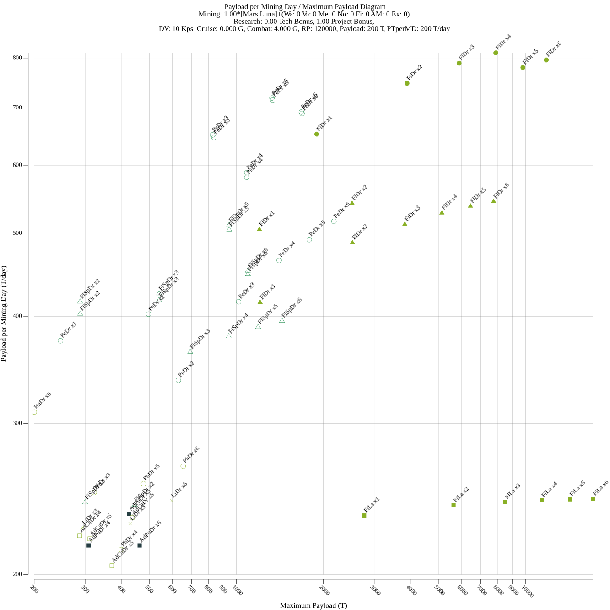

# Terra Invicta Tools
`ti_tools` is a set tools to help with various aspects of Terra Invicta gameplay.
Currently it only consists of a `drive_plot` utility that builds diagrams for drive comparison.
Although most of the "buisness domain" logic (read, in-game math) is contained in `ti_tools/ti` package
that can can be used standalone. Documentaton is almost non-existant, but I tried to make API
as self-evident as possible.

## Drive Plotter
A Next Generation(tm) drive comparison tool for Terra Invicta.

Terra Invicta is notorious for having a pleothera of drives with wildly different characteristics.
Even a seasoned player can't really tell whether a drive is good or not just by looking at numbers alone.
That is why from the earliest days people tried to come up with various methods to compare drives and, more importantly,
vizualize results of said comparisons.

First attempts just pulled basic drive data (EV and thrust) from game files and put it on 2D plot.
This allowed to see basic purpose of the drive and make very rough comparisons.
Although that charts failed pretty hard for closed-cycle drives that require heavy radiators,
dragging their performance down.

Next attempts brought in actual math that calculated real stats (usually DV and acceleration) of some kind model ship
with various drives installed.
Some of the plots even included a very important stat: drive cost.
Those cost calculations and realiztion that no one ever builds model ships inspirde creation of this tool.

The main idea behind it is that when picking a drive player already has *some* planned scenario for using it, e.g.
early interceptor or Alpha-base-busting dreadnought. So, when modeling drives you shouldn't try to see how a certain
drive performs on a certain ship but rather what kind of ship does drive allow to build (given certain constraints)
and how economically effective that will be.

What are those constraints? Delta-V, cruise acceleration, combat acceleration and research point limit. First three
should be self-explanatory. Last one is important because drives can have wildly different performance depending on
(for example) reactor used or availability of utility modules. Researching even Neutronium Spiker for early drives can
cost as much research as drive itself.

So, what do we plot? A `MPT/PTpMD` diagram. `MPT` stands for `Maximum Payload (tons)`. `PTpMD` stands for
`Payload (tons) per Mining Day`. `Payload` is defined as everything except drive, reactor, radiator and (possibly) EV
and thrust-boosting utility modules. So, `Maximum Payload` shows us the largest payload drive can carry within above
limits. `Mining Day` is an abstraction of resource cost. Each component costs maximum of each individual resources costs
divided by daily amount. E.g. if the cost is 10 metal and 5 nobles while you mine 100 and 10 respectively,
then cost = max(10/100, 5/10) = 0.5 MD. This allows us to correctly compare costs based on relative resource scarcity.
`PTpMD` tells us how many possible payload tons are we getting per unit of resource spent on the drive.
(Note that this value includes only the cost of drive itself, you'll still have to spend resources on building payload
itself.)

### Installation

Either download provided binaries or clone the repository and build it with Go (min version is 1.21.0).

### Usage

Most of those options should be self-explanatory.
```
Usage of drive_plot:
  -c string
        JSON-encoded constraints file
  -coa float
        minimum allowed combat acceleration (G's) (default 1e-06)
  -cpuprofile string
        (DEBUG) write cpu profile to file
  -cra float
        minimum allowed cruise acceleration (G's) (default 1e-06)
  -dv float
        minimum delta-V to target (Kps) (default 10)
  -log
        use logarighmic scale
  -o string
        file to write output to (default "output.png")
  -pl float
        minimum allowed payload weight (T) (default 200)
  -ptpmd float
        minimum allowed cost-efficiency for drive assembly (T/day) (default 200)
  -rp int
        maximum allowed RP cost for drive assembly (default 10000000)
  -size int
        size of output image (default 1000)
  -t string
        folder containing Terra Invicta template JSON files
```

The only non-obvious thing is constraints file. It contains various assumptions about game state that cannot be inferred
from templates alone. This is mostly about mining amounts (need to calcuate `Mining Day`) and research speed.
```
{
    // List of space bodies. Sum of average yields of each site will be used to calculate daily mining amounts.
    "mining_bodies": [ 
        "Mars",
        "Mercury",
        "Luna",
        "Ceres"
    ],
    "mining_bonus": 0, // Multiply the above sum by 1+bonus.
    "mining_flat": { // And add values below.
        "antimatter": 1,
        "exotics": 100000
    },
    "tech_bonus": 0, // All tech costs are divided by 1+bonus.
    "project_bonus": 1 // All project costs are divided by 1+bonus.
}
```

The end result looks like this:
```
$ drive_plot -t Templates -c interceptor.json --dv 10 --coa 4 --rp 120000 --log -o interceptor.png
2023/09/02 11:50:51 init started
2023/09/02 11:50:51 mining amount: Wa: 527 Vo: 333 Me: 433 No: 29 Fi: 35 AM: 0 Ex: 0
2023/09/02 11:50:51 simulation started
2023/09/02 11:50:51 AdPuDr x4 CoSoCoFiRe V TiDr - -: Pl 309 T, PTpMD 216 T/day, DV 10 Kps, CrA 0.100 G, CoA 4.000 G
2023/09/02 11:50:51 AdPuDr x5 CoSoCoFiRe V TiDr SlHyTa -: Pl 426 T, PTpMD 235 T/day, DV 12 Kps, CrA 0.100 G, CoA 4.000 G
2023/09/02 11:50:51 AdPuDr x6 CoSoCoFiRe V TiDr - -: Pl 463 T, PTpMD 216 T/day, DV 10 Kps, CrA 0.100 G, CoA 4.000 G
2023/09/02 11:50:51 FiSpDr x2 MoCoFiRe III NaFi - -: Pl 300 T, PTpMD 243 T/day, DV 13 Kps, CrA 0.200 G, CoA 4.000 G
2023/09/02 11:50:51 FiSpDr x2 MoCoFiRe III NaFi LiHyCo NeSp: Pl 444 T, PTpMD 241 T/day, DV 10 Kps, CrA 0.200 G, CoA 4.000 G
2023/09/02 11:50:51 FiSpDr x2 MoCoFiRe III NaFi SlHyTa -: Pl 288 T, PTpMD 416 T/day, DV 11 Kps, CrA 0.244 G, CoA 4.000 G
2023/09/02 11:50:51 FiSpDr x2 MoCoFiRe III TiDr SlHyTa -: Pl 288 T, PTpMD 403 T/day, DV 11 Kps, CrA 0.244 G, CoA 4.000 G
2023/09/02 11:50:51 FiSpDr x3 MoCoFiRe III NaFi LiHyCo NeSp: Pl 693 T, PTpMD 363 T/day, DV 10 Kps, CrA 0.200 G, CoA 4.000 G
2023/09/02 11:50:51 FiSpDr x3 MoCoFiRe III NaFi SlHyTa -: Pl 540 T, PTpMD 425 T/day, DV 12 Kps, CrA 0.200 G, CoA 4.000 G
2023/09/02 11:50:51 FiSpDr x3 MoCoFiRe III TiDr SlHyTa -: Pl 540 T, PTpMD 418 T/day, DV 12 Kps, CrA 0.200 G, CoA 4.000 G
2023/09/02 11:50:51 FiSpDr x4 MoCoFiRe III NaFi LiHyCo NeSp: Pl 941 T, PTpMD 379 T/day, DV 10 Kps, CrA 0.200 G, CoA 4.000 G
2023/09/02 11:50:51 FiSpDr x5 MoCoFiRe III NaFi LiHyCo NeSp: Pl 1189 T, PTpMD 389 T/day, DV 10 Kps, CrA 0.200 G, CoA 4.000 G
2023/09/02 11:50:51 FiSpDr x5 MoCoFiRe III NaFi SlHyTa -: Pl 944 T, PTpMD 511 T/day, DV 11 Kps, CrA 0.200 G, CoA 4.000 G
2023/09/02 11:50:51 FiSpDr x5 MoCoFiRe III TiDr SlHyTa -: Pl 944 T, PTpMD 505 T/day, DV 11 Kps, CrA 0.200 G, CoA 4.000 G
2023/09/02 11:50:51 FiSpDr x6 MoCoFiRe III NaFi LiHyCo NeSp: Pl 1438 T, PTpMD 395 T/day, DV 10 Kps, CrA 0.200 G, CoA 4.000 G
2023/09/02 11:50:51 FiSpDr x6 MoCoFiRe III NaFi SlHyTa -: Pl 1096 T, PTpMD 452 T/day, DV 12 Kps, CrA 0.200 G, CoA 4.000 G
2023/09/02 11:50:51 FiSpDr x6 MoCoFiRe III TiDr SlHyTa -: Pl 1096 T, PTpMD 448 T/day, DV 12 Kps, CrA 0.200 G, CoA 4.000 G
2023/09/02 11:50:51 PeDr x1 MoCoFiRe III NaFi - -: Pl 247 T, PTpMD 375 T/day, DV 11 Kps, CrA 0.200 G, CoA 4.000 G
2023/09/02 11:50:51 PeDr x2 MoCoFiRe III NaFi - -: Pl 497 T, PTpMD 402 T/day, DV 11 Kps, CrA 0.200 G, CoA 4.000 G
2023/09/02 11:50:51 PeDr x2 MoCoFiRe III NaFi - NeSp: Pl 630 T, PTpMD 337 T/day, DV 13 Kps, CrA 0.200 G, CoA 4.000 G
2023/09/02 11:50:51 PeDr x3 MoCoFiRe III AlFi SlHyTa -: Pl 827 T, PTpMD 651 T/day, DV 11 Kps, CrA 0.200 G, CoA 4.000 G
2023/09/02 11:50:51 PeDr x3 MoCoFiRe III NaFi - NeSp: Pl 1018 T, PTpMD 416 T/day, DV 11 Kps, CrA 0.200 G, CoA 4.000 G
2023/09/02 11:50:51 PeDr x3 MoCoFiRe III TiDr SlHyTa -: Pl 836 T, PTpMD 646 T/day, DV 11 Kps, CrA 0.200 G, CoA 4.000 G
2023/09/02 11:50:51 PeDr x4 MoCoFiRe III NaFi - NeSp: Pl 1406 T, PTpMD 465 T/day, DV 10 Kps, CrA 0.200 G, CoA 4.000 G
2023/09/02 11:50:51 PeDr x4 MoCoFiRe III NaFi SlHyTa -: Pl 1087 T, PTpMD 588 T/day, DV 12 Kps, CrA 0.200 G, CoA 4.000 G
2023/09/02 11:50:51 PeDr x4 MoCoFiRe III TiDr SlHyTa -: Pl 1087 T, PTpMD 581 T/day, DV 12 Kps, CrA 0.200 G, CoA 4.000 G
2023/09/02 11:50:51 PeDr x5 MoCoFiRe III AlFi SlHyTa -: Pl 1328 T, PTpMD 719 T/day, DV 10 Kps, CrA 0.211 G, CoA 4.000 G
2023/09/02 11:50:51 PeDr x5 MoCoFiRe III NaFi LiHyCo NeSp: Pl 1787 T, PTpMD 491 T/day, DV 11 Kps, CrA 0.200 G, CoA 4.000 G
2023/09/02 11:50:51 PeDr x5 MoCoFiRe III TiDr SlHyTa -: Pl 1337 T, PTpMD 715 T/day, DV 10 Kps, CrA 0.211 G, CoA 4.000 G
2023/09/02 11:50:51 PeDr x6 MoCoFiRe III AlFi SlHyTa -: Pl 1679 T, PTpMD 692 T/day, DV 11 Kps, CrA 0.200 G, CoA 4.000 G
2023/09/02 11:50:51 PeDr x6 MoCoFiRe III NaFi LiHyCo NeSp: Pl 2175 T, PTpMD 516 T/day, DV 10 Kps, CrA 0.200 G, CoA 4.000 G
2023/09/02 11:50:51 PeDr x6 MoCoFiRe III TiDr SlHyTa -: Pl 1688 T, PTpMD 689 T/day, DV 11 Kps, CrA 0.200 G, CoA 4.000 G
2023/09/02 11:50:51 AdCaDr x4 GaCoFiRe III TiDr SlHyTa -: Pl 287 T, PTpMD 222 T/day, DV 13 Kps, CrA 0.200 G, CoA 4.000 G
2023/09/02 11:50:51 AdCaDr x5 GaCoFiRe III TiDr SlHyTa -: Pl 311 T, PTpMD 220 T/day, DV 12 Kps, CrA 0.227 G, CoA 4.000 G
2023/09/02 11:50:51 AdCaDr x5 GaCoFiRe VI NaFi - -: Pl 371 T, PTpMD 205 T/day, DV 11 Kps, CrA 0.200 G, CoA 4.000 G
2023/09/02 11:50:51 AdCaDr x6 GaCoFiRe III TiDr SlHyTa -: Pl 436 T, PTpMD 233 T/day, DV 13 Kps, CrA 0.200 G, CoA 4.000 G
2023/09/02 11:50:51 LiDr x3 GaCoFiRe III TiDr SlHyTa -: Pl 293 T, PTpMD 227 T/day, DV 11 Kps, CrA 0.200 G, CoA 4.000 G
2023/09/02 11:50:51 LiDr x5 GaCoFiRe III TiDr SlHyTa -: Pl 429 T, PTpMD 229 T/day, DV 11 Kps, CrA 0.221 G, CoA 4.000 G
2023/09/02 11:50:51 LiDr x6 GaCoFiRe III TiDr SlHyTa -: Pl 597 T, PTpMD 244 T/day, DV 11 Kps, CrA 0.200 G, CoA 4.000 G
2023/09/02 11:50:51 PhDr x3 GaCoFiRe III TiDr SlHyTa -: Pl 322 T, PTpMD 249 T/day, DV 11 Kps, CrA 0.200 G, CoA 4.000 G
2023/09/02 11:50:51 PhDr x4 GaCoFiRe III TiDr SlHyTa -: Pl 400 T, PTpMD 214 T/day, DV 12 Kps, CrA 0.200 G, CoA 4.000 G
2023/09/02 11:50:51 PhDr x5 GaCoFiRe III TiDr SlHyTa -: Pl 477 T, PTpMD 255 T/day, DV 10 Kps, CrA 0.219 G, CoA 4.000 G
2023/09/02 11:50:51 PhDr x6 GaCoFiRe III TiDr SlHyTa -: Pl 655 T, PTpMD 267 T/day, DV 11 Kps, CrA 0.200 G, CoA 4.000 G
2023/09/02 11:50:51 FiLa x1 GaCoFiRe VI NaFi LiHyCo -: Pl 2768 T, PTpMD 234 T/day, DV 10 Kps, CrA 0.204 G, CoA 4.000 G
2023/09/02 11:50:51 FiLa x2 GaCoFiRe VI NaFi LiHyCo -: Pl 5641 T, PTpMD 241 T/day, DV 10 Kps, CrA 0.202 G, CoA 4.000 G
2023/09/02 11:50:51 FiLa x3 GaCoFiRe VI NaFi LiHyCo -: Pl 8513 T, PTpMD 243 T/day, DV 10 Kps, CrA 0.200 G, CoA 4.000 G
2023/09/02 11:50:51 FiLa x4 GaCoFiRe VI NaFi LiHyCo -: Pl 11386 T, PTpMD 244 T/day, DV 10 Kps, CrA 0.200 G, CoA 4.000 G
2023/09/02 11:50:51 FiLa x5 GaCoFiRe VI NaFi LiHyCo -: Pl 14259 T, PTpMD 245 T/day, DV 10 Kps, CrA 0.200 G, CoA 4.000 G
2023/09/02 11:50:51 FiLa x6 GaCoFiRe VI NaFi LiHyCo -: Pl 17132 T, PTpMD 245 T/day, DV 10 Kps, CrA 0.200 G, CoA 4.000 G
2023/09/02 11:50:51 BuDr x6 GaCoFiRe VI NaFi - -: Pl 200 T, PTpMD 309 T/day, DV 25 Kps, CrA 0.200 G, CoA 4.000 G
2023/09/02 11:50:51 FlDr x1 GaCoFiRe VI NaFi - -: Pl 1208 T, PTpMD 415 T/day, DV 12 Kps, CrA 0.200 G, CoA 4.000 G
2023/09/02 11:50:51 FlDr x1 GaCoFiRe VI NaFi LiHyCo -: Pl 1202 T, PTpMD 505 T/day, DV 10 Kps, CrA 0.212 G, CoA 4.000 G
2023/09/02 11:50:51 FlDr x2 GaCoFiRe VI NaFi - -: Pl 2521 T, PTpMD 487 T/day, DV 10 Kps, CrA 0.200 G, CoA 4.000 G
2023/09/02 11:50:51 FlDr x2 GaCoFiRe VI NaFi LiHyCo -: Pl 2514 T, PTpMD 542 T/day, DV 10 Kps, CrA 0.206 G, CoA 4.000 G
2023/09/02 11:50:51 FlDr x3 GaCoFiRe VI NaFi LiHyCo -: Pl 3827 T, PTpMD 512 T/day, DV 11 Kps, CrA 0.200 G, CoA 4.000 G
2023/09/02 11:50:51 FlDr x4 GaCoFiRe VI NaFi LiHyCo -: Pl 5139 T, PTpMD 528 T/day, DV 10 Kps, CrA 0.200 G, CoA 4.000 G
2023/09/02 11:50:51 FlDr x5 GaCoFiRe VI NaFi LiHyCo -: Pl 6451 T, PTpMD 538 T/day, DV 10 Kps, CrA 0.200 G, CoA 4.000 G
2023/09/02 11:50:51 FlDr x6 GaCoFiRe VI NaFi LiHyCo -: Pl 7764 T, PTpMD 544 T/day, DV 10 Kps, CrA 0.200 G, CoA 4.000 G
2023/09/02 11:50:51 FiDr x1 GaCoFiRe VI NaFi - -: Pl 1898 T, PTpMD 652 T/day, DV 11 Kps, CrA 0.200 G, CoA 4.000 G
2023/09/02 11:50:51 FiDr x2 GaCoFiRe VI NaFi LiHyCo -: Pl 3894 T, PTpMD 748 T/day, DV 11 Kps, CrA 0.200 G, CoA 4.000 G
2023/09/02 11:50:51 FiDr x3 GaCoFiRe VI NaFi LiHyCo -: Pl 5896 T, PTpMD 789 T/day, DV 10 Kps, CrA 0.200 G, CoA 4.000 G
2023/09/02 11:50:51 FiDr x4 GaCoFiRe VI NaFi LiHyCo -: Pl 7898 T, PTpMD 811 T/day, DV 10 Kps, CrA 0.200 G, CoA 4.000 G
2023/09/02 11:50:51 FiDr x5 GaCoFiRe VI NaFi LiHyCo -: Pl 9800 T, PTpMD 780 T/day, DV 10 Kps, CrA 0.200 G, CoA 4.000 G
2023/09/02 11:50:51 FiDr x6 GaCoFiRe VI NaFi LiHyCo -: Pl 11803 T, PTpMD 796 T/day, DV 10 Kps, CrA 0.200 G, CoA 4.000 G
2023/09/02 11:50:51 drives total: 64
```


```
$ drive_plot -t Templates -c alpha_chad.json --dv 1000 --pl 20000 -coa 0.1 -cra 0.01 --log -o alpha_chad.png
2023/09/02 11:52:17 init started
2023/09/02 11:52:17 mining amount: Wa: 863 Vo: 485 Me: 864 No: 118 Fi: 41 AM: 1 Ex: 100000
2023/09/02 11:52:17 simulation started
2023/09/02 11:52:18 IcDr x5 HyCoFuRe III LiSp HyTr AnSp: Pl 23128 T, PTpMD 477 T/day, DV 1005 Kps, CrA 0.010 G, CoA 0.600 G
2023/09/02 11:52:18 IcDr x5 HyCoFuRe III DuPl HyTr AnSp: Pl 23476 T, PTpMD 445 T/day, DV 1005 Kps, CrA 0.010 G, CoA 0.600 G
2023/09/02 11:52:18 IcDr x5 HyCoFuRe III ExSp HyTr AnSp: Pl 23702 T, PTpMD 444 T/day, DV 1005 Kps, CrA 0.010 G, CoA 0.600 G
2023/09/02 11:52:18 IcDr x6 HyCoFuRe III LiSp HyTr AnSp: Pl 27806 T, PTpMD 479 T/day, DV 1002 Kps, CrA 0.010 G, CoA 0.600 G
2023/09/02 11:52:18 IcDr x6 HyCoFuRe III DuPl HyTr AnSp: Pl 28224 T, PTpMD 447 T/day, DV 1002 Kps, CrA 0.010 G, CoA 0.600 G
2023/09/02 11:52:18 IcDr x6 HyCoFuRe III ExSp HyTr AnSp: Pl 28495 T, PTpMD 445 T/day, DV 1002 Kps, CrA 0.010 G, CoA 0.600 G
2023/09/02 11:52:18 IcTo x2 HyCoFuRe III TiDr HyTr AnSp: Pl 22374 T, PTpMD 497 T/day, DV 1013 Kps, CrA 0.010 G, CoA 0.600 G
2023/09/02 11:52:18 IcTo x2 HyCoFuRe III LiSp HyTr AnSp: Pl 25399 T, PTpMD 293 T/day, DV 1013 Kps, CrA 0.010 G, CoA 0.600 G
2023/09/02 11:52:18 IcTo x3 HyCoFuRe III TiDr HyTr AnSp: Pl 33591 T, PTpMD 498 T/day, DV 1013 Kps, CrA 0.010 G, CoA 0.600 G
2023/09/02 11:52:18 IcTo x3 HyCoFuRe III LiSp HyTr AnSp: Pl 38129 T, PTpMD 294 T/day, DV 1013 Kps, CrA 0.010 G, CoA 0.600 G
2023/09/02 11:52:18 IcTo x4 HyCoFuRe III TiDr HyTr AnSp: Pl 44908 T, PTpMD 500 T/day, DV 1001 Kps, CrA 0.010 G, CoA 0.600 G
2023/09/02 11:52:18 IcTo x4 HyCoFuRe III LiSp HyTr AnSp: Pl 50959 T, PTpMD 295 T/day, DV 1001 Kps, CrA 0.010 G, CoA 0.600 G
2023/09/02 11:52:18 IcTo x5 HyCoFuRe III TiDr HyTr AnSp: Pl 56125 T, PTpMD 500 T/day, DV 1003 Kps, CrA 0.010 G, CoA 0.600 G
2023/09/02 11:52:18 IcTo x5 HyCoFuRe III LiSp HyTr AnSp: Pl 63688 T, PTpMD 296 T/day, DV 1003 Kps, CrA 0.010 G, CoA 0.600 G
2023/09/02 11:52:18 IcTo x6 HyCoFuRe III TiDr HyTr AnSp: Pl 67342 T, PTpMD 500 T/day, DV 1005 Kps, CrA 0.010 G, CoA 0.600 G
2023/09/02 11:52:18 IcTo x6 HyCoFuRe III LiSp HyTr AnSp: Pl 76418 T, PTpMD 296 T/day, DV 1005 Kps, CrA 0.010 G, CoA 0.600 G
2023/09/02 11:52:18 ZeHeDr x5 FlStZ-Fu Reactor LiSp HyTr AnSp: Pl 20494 T, PTpMD 1686 T/day, DV 1013 Kps, CrA 0.010 G, CoA 0.600 G
2023/09/02 11:52:18 ZeHeDr x5 FlStZ-Fu Reactor ExSp HyTr AnSp: Pl 21072 T, PTpMD 1257 T/day, DV 1013 Kps, CrA 0.010 G, CoA 0.600 G
2023/09/02 11:52:18 ZeHeDr x6 FlStZ-Fu Reactor LiSp HyTr AnSp: Pl 24584 T, PTpMD 1681 T/day, DV 1018 Kps, CrA 0.010 G, CoA 0.600 G
2023/09/02 11:52:18 ZeHeDr x6 FlStZ-Fu Reactor ExSp HyTr AnSp: Pl 25278 T, PTpMD 1264 T/day, DV 1018 Kps, CrA 0.010 G, CoA 0.600 G
2023/09/02 11:52:18 ZeBoFuDr x3 FlStZ-Fu Reactor ExSp HyTr AnSp: Pl 20808 T, PTpMD 587 T/day, DV 1005 Kps, CrA 0.010 G, CoA 0.600 G
2023/09/02 11:52:18 ZeBoFuDr x4 FlStZ-Fu Reactor ExSp HyTr AnSp: Pl 27797 T, PTpMD 591 T/day, DV 1001 Kps, CrA 0.010 G, CoA 0.600 G
2023/09/02 11:52:18 ZeBoFuDr x5 FlStZ-Fu Reactor ExSp HyTr AnSp: Pl 34686 T, PTpMD 591 T/day, DV 1002 Kps, CrA 0.010 G, CoA 0.601 G
2023/09/02 11:52:18 ZeBoFuDr x6 FlStZ-Fu Reactor ExSp HyTr AnSp: Pl 41675 T, PTpMD 592 T/day, DV 1000 Kps, CrA 0.010 G, CoA 0.601 G
2023/09/02 11:52:18 DaTo x3 InCoFuRe VII TiDr HyTr MuSp: Pl 21792 T, PTpMD 4604 T/day, DV 1011 Kps, CrA 0.010 G, CoA 0.600 G
2023/09/02 11:52:18 DaTo x3 InCoFuRe VII TiDr HyTr NeSp: Pl 24634 T, PTpMD 4529 T/day, DV 1038 Kps, CrA 0.010 G, CoA 0.600 G
2023/09/02 11:52:18 DaTo x3 InCoFuRe VII TiDr HyTr AnSp: Pl 27476 T, PTpMD 4472 T/day, DV 1059 Kps, CrA 0.010 G, CoA 0.600 G
2023/09/02 11:52:18 DaTo x3 InCoFuRe VII LiSp HyTr AnSp: Pl 27926 T, PTpMD 4442 T/day, DV 1059 Kps, CrA 0.010 G, CoA 0.600 G
2023/09/02 11:52:18 DaTo x3 InCoFuRe VII ExSp HyTr AnSp: Pl 28255 T, PTpMD 2843 T/day, DV 1059 Kps, CrA 0.010 G, CoA 0.600 G
2023/09/02 11:52:18 DaTo x4 InCoFuRe VII TiDr HyTr AnSp: Pl 36722 T, PTpMD 4644 T/day, DV 1027 Kps, CrA 0.010 G, CoA 0.600 G
2023/09/02 11:52:18 DaTo x4 InCoFuRe VII LiSp HyTr AnSp: Pl 37321 T, PTpMD 4560 T/day, DV 1027 Kps, CrA 0.010 G, CoA 0.600 G
2023/09/02 11:52:18 DaTo x4 InCoFuRe VII ExSp HyTr AnSp: Pl 37760 T, PTpMD 2892 T/day, DV 1027 Kps, CrA 0.010 G, CoA 0.600 G
2023/09/02 11:52:18 DaTo x5 InCoFuRe VII TiDr HyTr AnSp: Pl 45967 T, PTpMD 4753 T/day, DV 1008 Kps, CrA 0.010 G, CoA 0.600 G
2023/09/02 11:52:18 DaTo x5 InCoFuRe VII LiSp HyTr AnSp: Pl 46716 T, PTpMD 4633 T/day, DV 1008 Kps, CrA 0.010 G, CoA 0.600 G
2023/09/02 11:52:18 DaTo x5 InCoFuRe VII ExSp HyTr AnSp: Pl 47265 T, PTpMD 2923 T/day, DV 1008 Kps, CrA 0.010 G, CoA 0.600 G
2023/09/02 11:52:18 DaTo x6 InCoFuRe VII TiDr HyTr NeSp: Pl 49428 T, PTpMD 4763 T/day, DV 1002 Kps, CrA 0.010 G, CoA 0.600 G
2023/09/02 11:52:18 DaTo x6 InCoFuRe VII TiDr HyTr AnSp: Pl 55113 T, PTpMD 4675 T/day, DV 1027 Kps, CrA 0.010 G, CoA 0.600 G
2023/09/02 11:52:18 DaTo x6 InCoFuRe VII LiSp HyTr AnSp: Pl 56011 T, PTpMD 4675 T/day, DV 1027 Kps, CrA 0.010 G, CoA 0.600 G
2023/09/02 11:52:18 DaTo x6 InCoFuRe VII ExSp HyTr AnSp: Pl 56670 T, PTpMD 2938 T/day, DV 1027 Kps, CrA 0.010 G, CoA 0.600 G
2023/09/02 11:52:18 PrInTo x6 InCoFuRe VII LiSp - AnSp: Pl 22013 T, PTpMD 2562 T/day, DV 1003 Kps, CrA 0.010 G, CoA 0.602 G
2023/09/02 11:52:18 PrInTo x6 InCoFuRe VII ExSp - AnSp: Pl 22319 T, PTpMD 2453 T/day, DV 1003 Kps, CrA 0.010 G, CoA 0.602 G
2023/09/02 11:52:18 PrCoTo x1 InCoFuRe VII NaFi - NeSp: Pl 1244448 T, PTpMD 2693 T/day, DV 1000 Kps, CrA 0.010 G, CoA 0.600 G
2023/09/02 11:52:18 PrCoTo x1 InCoFuRe VII NaFi - AnSp: Pl 1382906 T, PTpMD 2692 T/day, DV 1000 Kps, CrA 0.010 G, CoA 0.600 G
2023/09/02 11:52:18 PrCoTo x1 InCoFuRe VII ExSp - NeSp: Pl 1244454 T, PTpMD 2693 T/day, DV 1000 Kps, CrA 0.010 G, CoA 0.600 G
2023/09/02 11:52:18 PrCoTo x1 InCoFuRe VII ExSp - AnSp: Pl 1382912 T, PTpMD 2692 T/day, DV 1000 Kps, CrA 0.010 G, CoA 0.600 G
2023/09/02 11:52:18 PrCoTo x2 InCoFuRe VII NaFi - NeSp: Pl 2489045 T, PTpMD 2693 T/day, DV 1000 Kps, CrA 0.010 G, CoA 0.600 G
2023/09/02 11:52:18 PrCoTo x2 InCoFuRe VII NaFi - AnSp: Pl 2765860 T, PTpMD 2693 T/day, DV 1000 Kps, CrA 0.010 G, CoA 0.600 G
2023/09/02 11:52:18 PrCoTo x2 InCoFuRe VII ExSp - NeSp: Pl 2489051 T, PTpMD 2693 T/day, DV 1000 Kps, CrA 0.010 G, CoA 0.600 G
2023/09/02 11:52:18 PrCoTo x2 InCoFuRe VII ExSp - AnSp: Pl 2765865 T, PTpMD 2693 T/day, DV 1000 Kps, CrA 0.010 G, CoA 0.600 G
2023/09/02 11:52:18 PrCoTo x3 InCoFuRe VII NaFi - AnSp: Pl 4148914 T, PTpMD 2693 T/day, DV 1000 Kps, CrA 0.010 G, CoA 0.600 G
2023/09/02 11:52:18 PrCoTo x3 InCoFuRe VII ExSp - AnSp: Pl 4148919 T, PTpMD 2693 T/day, DV 1000 Kps, CrA 0.010 G, CoA 0.600 G
2023/09/02 11:52:18 PrCoTo x4 InCoFuRe VII NaFi - AnSp: Pl 5531868 T, PTpMD 2693 T/day, DV 1000 Kps, CrA 0.010 G, CoA 0.600 G
2023/09/02 11:52:18 PrCoTo x4 InCoFuRe VII ExSp - AnSp: Pl 5531873 T, PTpMD 2693 T/day, DV 1000 Kps, CrA 0.010 G, CoA 0.600 G
2023/09/02 11:52:18 PrCoTo x5 InCoFuRe VII NaFi - AnSp: Pl 6914921 T, PTpMD 2694 T/day, DV 1000 Kps, CrA 0.010 G, CoA 0.600 G
2023/09/02 11:52:18 PrCoTo x5 InCoFuRe VII ExSp - AnSp: Pl 6914927 T, PTpMD 2694 T/day, DV 1000 Kps, CrA 0.010 G, CoA 0.600 G
2023/09/02 11:52:18 PrCoTo x6 InCoFuRe VII NaFi - AnSp: Pl 8297875 T, PTpMD 2693 T/day, DV 1000 Kps, CrA 0.010 G, CoA 0.600 G
2023/09/02 11:52:18 PrCoTo x6 InCoFuRe VII ExSp - AnSp: Pl 8297881 T, PTpMD 2693 T/day, DV 1000 Kps, CrA 0.010 G, CoA 0.600 G
2023/09/02 11:52:18 AnPlCoDr x1 AnPlCoRe III ExSp HyTr NeSp: Pl 20713 T, PTpMD 214 T/day, DV 1001 Kps, CrA 0.010 G, CoA 0.600 G
2023/09/02 11:52:18 AnPlCoDr x1 AnPlCoRe III ExSp HyTr AnSp: Pl 22967 T, PTpMD 214 T/day, DV 1001 Kps, CrA 0.010 G, CoA 0.601 G
2023/09/02 11:52:18 AnPlCoDr x2 AnPlCoRe III ExSp HyTr -: Pl 30747 T, PTpMD 215 T/day, DV 1001 Kps, CrA 0.010 G, CoA 0.600 G
2023/09/02 11:52:18 AnPlCoDr x2 AnPlCoRe III ExSp HyTr NeSp: Pl 41490 T, PTpMD 214 T/day, DV 1001 Kps, CrA 0.010 G, CoA 0.600 G
2023/09/02 11:52:18 AnPlCoDr x2 AnPlCoRe III ExSp HyTr AnSp: Pl 46097 T, PTpMD 214 T/day, DV 1001 Kps, CrA 0.010 G, CoA 0.600 G
2023/09/02 11:52:18 AnPlCoDr x3 AnPlCoRe III ExSp HyTr AnSp: Pl 69227 T, PTpMD 215 T/day, DV 1000 Kps, CrA 0.010 G, CoA 0.600 G
2023/09/02 11:52:18 AnPlCoDr x4 AnPlCoRe III ExSp HyTr -: Pl 61517 T, PTpMD 215 T/day, DV 1000 Kps, CrA 0.010 G, CoA 0.600 G
2023/09/02 11:52:18 AnPlCoDr x4 AnPlCoRe III ExSp HyTr NeSp: Pl 83042 T, PTpMD 215 T/day, DV 1000 Kps, CrA 0.010 G, CoA 0.600 G
2023/09/02 11:52:18 AnPlCoDr x4 AnPlCoRe III ExSp HyTr AnSp: Pl 92256 T, PTpMD 215 T/day, DV 1000 Kps, CrA 0.010 G, CoA 0.600 G
2023/09/02 11:52:18 AnPlCoDr x5 AnPlCoRe III ExSp HyTr AnSp: Pl 115386 T, PTpMD 215 T/day, DV 1000 Kps, CrA 0.010 G, CoA 0.600 G
2023/09/02 11:52:18 AnPlCoDr x6 AnPlCoRe III ExSp HyTr AnSp: Pl 138516 T, PTpMD 215 T/day, DV 1000 Kps, CrA 0.010 G, CoA 0.600 G
2023/09/02 11:52:18 AdAnPlCoDr x1 AnPlCoRe III ExSp HyTr AnSp: Pl 61839 T, PTpMD 1420 T/day, DV 1004 Kps, CrA 0.010 G, CoA 0.600 G
2023/09/02 11:52:18 AdAnPlCoDr x2 AnPlCoRe III ExSp HyTr AnSp: Pl 123738 T, PTpMD 1429 T/day, DV 1000 Kps, CrA 0.010 G, CoA 0.600 G
2023/09/02 11:52:18 AdAnPlCoDr x3 AnPlCoRe III ExSp HyTr AnSp: Pl 185736 T, PTpMD 1429 T/day, DV 1001 Kps, CrA 0.010 G, CoA 0.600 G
2023/09/02 11:52:18 AdAnPlCoDr x4 AnPlCoRe III ExSp HyTr AnSp: Pl 247635 T, PTpMD 1429 T/day, DV 1002 Kps, CrA 0.010 G, CoA 0.600 G
2023/09/02 11:52:18 AdAnPlCoDr x5 AnPlCoRe III ExSp HyTr AnSp: Pl 309634 T, PTpMD 1431 T/day, DV 1000 Kps, CrA 0.010 G, CoA 0.600 G
2023/09/02 11:52:18 AdAnPlCoDr x6 AnPlCoRe III ExSp HyTr AnSp: Pl 371533 T, PTpMD 1430 T/day, DV 1001 Kps, CrA 0.010 G, CoA 0.600 G
2023/09/02 11:52:18 drives total: 74
```
